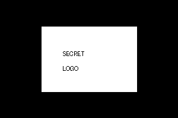

# Image Security: AES Encryption + LSB Steganography

This is a fully working version of the project.

## Files

- `encryption.py` - AES-CBC file encryption and decryption
- `steganography.py` - command-line interface for image hiding/extraction
- `steg/steg_img.py` - missing `steg_img` module fixed
- `images/` - demo input images
- `outputs/` - demo output images

## Install

```bash
pip install -r requirements.txt
```

## Run Steganography

Hide a secret image inside a cover image:

```bash
python steganography.py -c images/cover.png -p images/secret.png -o outputs/stego.png
```

Extract the hidden image:

```bash
python steganography.py -c outputs/stego.png -o outputs/extracted.png
```

## Run Encryption

```bash
python encryption.py
```

Then choose `E` for encryption or `D` for decryption.

## Demo Output

### Cover Image


### Secret Image


### Stego Image


### Extracted Image

